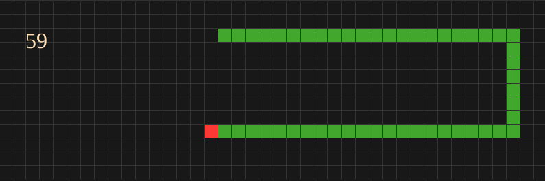

# Snake Game HTML Divs

## It is just a performance test using the snake game as an example. 

The game is implemented using HTML divs and CSS.

Each cell of the game is a div element with a specific class that represents the state of the cell.

The main goal is to test the performance of the game using different methods to update HTML.

**CPU: AMD Ryzen 7 7800x3d**

### First implementation:

For each cell, I was creating a new div element and appending it to the root element.
For each frame, I was removing all the cells and creating new ones.
I had an O(n^3) complexity to update the game state.

> * 800x600
>    * snake size 10 = ~60 FPS
>    * snake size 50 = ~60 FPS
>    * snake size 100 = ~51 FPS
>    * snake size 500 = ~14 FPS
>    * snake size 1.000 = ~7 FPS
>
> * 1920x1080
>    * snake size 10 = ~34 FPS
>    * snake size 50 = ~22 FPS
>    * snake size 100 = ~15 FPS
>    * snake size 500 = ~4 FPS
>    * snake size 1.000 = ~2 FPS

### Second implementation:

I created all div cells at the beginning and I was just changing the class of the cells to update the game state.
Removed the O(n^3) complexity.

> * 800x600
>    * snake size 100 = ~60 FPS
>    * snake size 1.000 = ~60 FPS
>    * snake size 10.000 = ~60 FPS
>    * snake size 100.000 = ~60 FPS
>
> * 1920x1080
>    * snake size 100 = ~60 FPS
>    * snake size 1.000 = ~60 FPS
>    * snake size 10.000 = ~60 FPS
>    * snake size 100.000 = ~60 FPS
